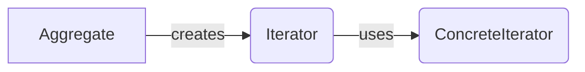
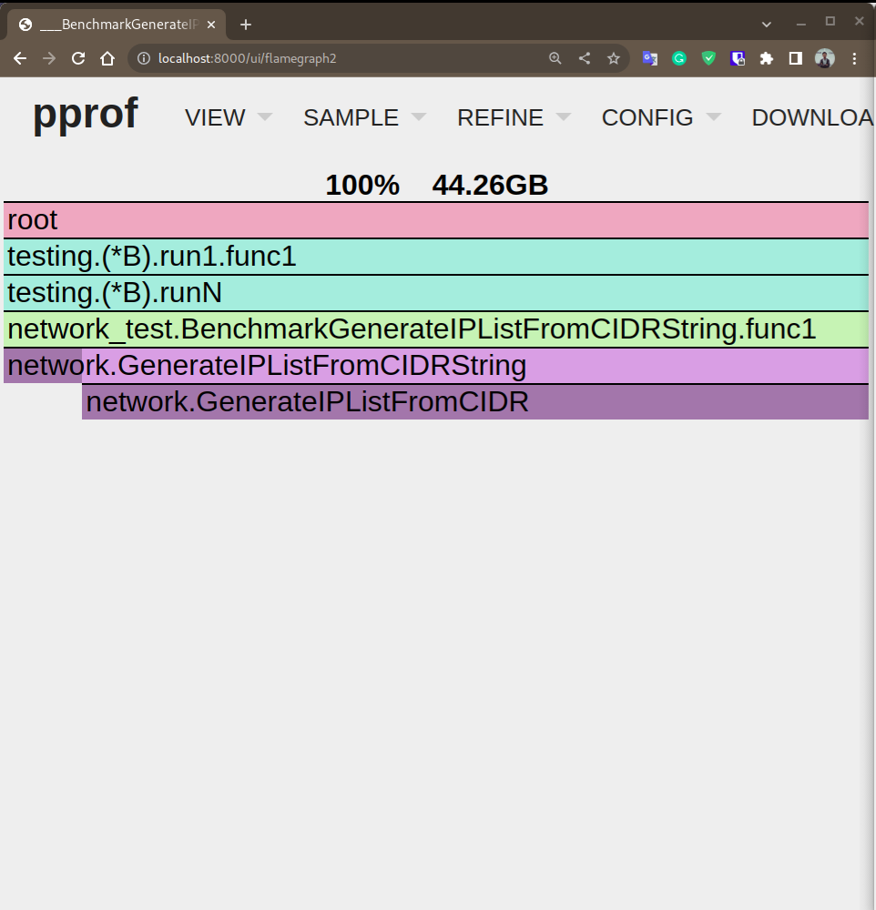
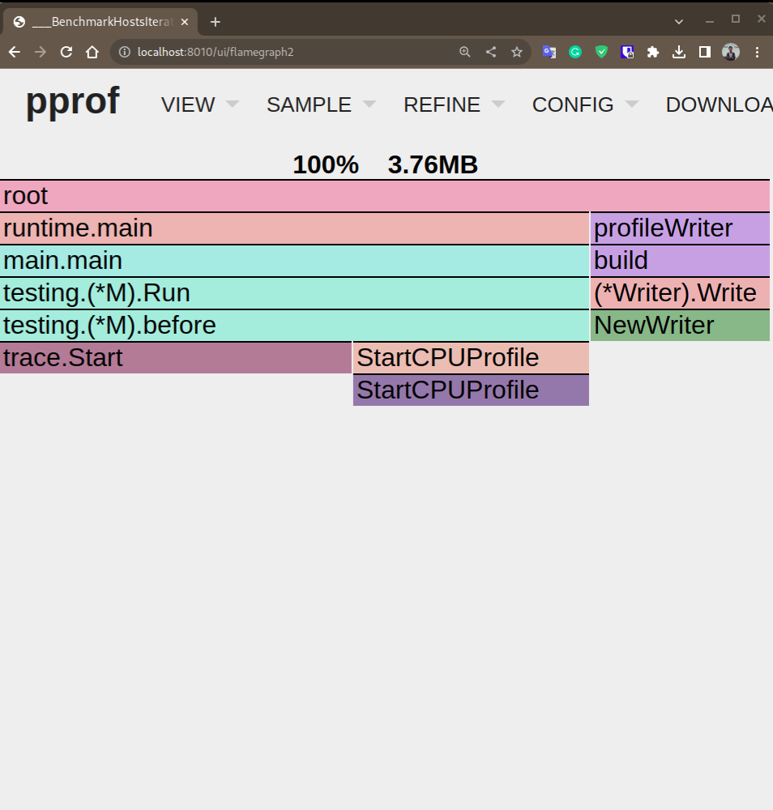

+++
author = "Fadhil Yori Hibatullah"
title = "Addressing the Memory Leak Bug in My Personal Project (subping)"
date = "2023-07-06"
draft = false
description = "Encountered a critical memory leak issue while handling IPv6 hosts in [subping](https://github.com/fadhilyori/subping). Investigating the problem's impact on performance, stability, and scalability. Conducting benchmark tests to identify the root cause and develop an optimized solution for stable and efficient handling of IPv6 hosts."
tags = [
    "network",
    "ping",
    "scanning",
]
categories = [
    "writeup",
    "note",
]
series = ["Bug", "Design Pattern", "Coding"]
image = "cover.jpg"
+++

# Addressing the Memory Leak Bug in My Personal Project (subping)

> **Author**: [Fadhil Yori](https://github.com/fadhilyori)  
> **Project**: [https://github.com/fadhilyori/subping](https://github.com/fadhilyori/subping)  
> **Related Issue**: [https://github.com/fadhilyori/subping/issues/23](https://github.com/fadhilyori/subping/issues/23)

# Background

During the development process of [subping](https://github.com/fadhilyori/subping), our team encountered a critical issue involving a memory leak that specifically occurs when handling a substantial number of [IPv6](https://en.wikipedia.org/wiki/IPv6_address) hosts. This memory leak has a negative impact on the application's performance and raises concerns regarding its stability and scalability.

We have observed that the leak becomes more pronounced as the number of IPv6 hosts increases. This observation has led us to investigate the intricacies of IPv6 host handling and its impact on memory management within the application. The significant increase in memory consumption under these conditions indicates the presence of a memory leak. Extensive testing and simulations have confirmed the intensity of the leak and its direct correlation with the workload. As a result, we have undertaken a focused investigation into the complex dynamics between IPv6 host handling and memory management. Armed with this knowledge, we have embarked on developing an optimized solution to ensure the stability and efficiency of subping.

To gain further insights and effectively address this issue, we have initiated a comprehensive benchmark test. This test aims to evaluate the application's performance under various scenarios, with a specific focus on monitoring memory usage during the processing of IPv6 hosts. Through this benchmark test, our objective is to uncover patterns and behaviors that will help us identify the root cause of the memory leak.

Our ultimate goal is to ensure a stable and efficient solution for handling IPv6 hosts within the subping application.

# Main Problem

The following code snippet demonstrates a function called **GenerateIPListFromCIDR** that generates a list of IP addresses within a specified range using CIDR notation. However, careful examination reveals a memory leak in the implementation, which can lead to inefficient memory usage over time.

```go
// GenerateIPListFromCIDR generates a list of IP addresses within the specified range
// based on the given CIDR notation.
func GenerateIPListFromCIDR(cidr *net.IPNet) []net.IP {
	var ips []net.IP

	firstIP := make(net.IP, len(cidr.IP))
	copy(firstIP, cidr.IP)

	for cidr.Contains(firstIP) {
		newIP := make(net.IP, len(firstIP))
		copy(newIP, firstIP)
		ips = append(ips, newIP)

		inc(firstIP)
	}

	return append([]net.IP{}, ips...)
}

// inc increments the given IP address by one.
// It handles both IPv4 and IPv6 addresses.
func inc(ip net.IP) {
	for j := len(ip) - 1; j >= 0; j-- {
		ip[j]++
		if ip[j] > 0 {
			break
		}
	}
}
```

The memory leak in this code arises due to a combination of factors. Firstly, each IP address generated within the range is appended to the `ips` slice using the `append` function. However, with each append operation, a new copy of the IP address is created using `make` and `copy`, resulting in unnecessary memory allocation and consumption.

Furthermore, the original implementation includes the line `append([]net.IP{}, ips...)` at the end of the function, which creates a new slice and copies all IP addresses from the `ips` slice. This duplication further exacerbates the memory usage issue.

# The Solution: Utilizing the Iterator Design Pattern

To address the memory leak issue and optimize the code, we have utilized the Iterator design pattern. This pattern enables us to encapsulate the iteration logic and provide a consistent interface for traversing individual host IP addresses within the specified CIDR range.

By applying the Iterator design pattern, we achieve a clear separation of concerns, keeping the traversal behavior decoupled from the underlying data structure. This promotes loose coupling and enhances code maintainability, as clients can now access elements sequentially without being exposed to the implementation details of the data structure.

In our solution, we introduced the `HostsIterator` struct, which serves as the iterator. It takes responsibility for maintaining the iteration state and provides a method (`Next`) to advance to the next IP address. By encapsulating the iteration logic within the `HostsIterator` struct, we adhere to the principles of the Iterator design pattern.

To ensure an organized codebase, we suggest placing the `HostsIterator` struct and its associated methods (`NewHostsIterator` and `Next`) in a dedicated file or section that focuses specifically on iterator-related functionality. This approach promotes a clear separation of concerns and facilitates easy reuse and future extension of the iterator implementation.

By leveraging the power of the Iterator design pattern, we enhance the clarity and maintainability of our code. Clients can now seamlessly iterate over host IP addresses within a CIDR range using a consistent and intuitive interface.

## The Iterator Design Pattern

The Iterator design pattern is a behavioral design pattern that provides a way to access elements of an aggregate object sequentially without exposing its underlying representation. It separates the traversal behavior from the aggregate object, allowing clients to access elements in a consistent manner without knowing the internal structure of the object.

### Key Participants

The Iterator design pattern typically involves the following key participants:

- **Iterator**: Defines the interface for accessing elements in the collection.
- **ConcreteIterator**: Implements the Iterator interface, keeps track of the current position in the collection, and provides methods for traversing the collection.
- **Aggregate**: Defines the interface for creating an Iterator object.
- **Concrete Aggregate**: Implements the Aggregate interface and returns a ConcreteIterator that traverses the collection.

### Benefits of the Iterator Design Pattern

The Iterator design pattern offers several benefits, including:

- **Separation of Concerns**: The pattern separates the traversal behavior from the underlying collection, promoting a clear separation of concerns.
- **Decoupling**: Clients can iterate over elements without being exposed to the internal structure of the collection, reducing dependencies.
- **Flexibility**: It allows for multiple iterators to coexist and iterate over the same collection independently.
- **Consistency**: Provides a unified interface for iterating over elements, regardless of the specific collection implementation.

### Graph Representation

The following graph illustrates the structure of the Iterator design pattern:



## The New Code

`HostsIterator` represents an iterator for traversing the individual host IP addresses within a given CIDR range.

```go
type HostsIterator struct {
	IPNet     *net.IPNet
	CurrentIP *net.IP
	FirstIP   net.IP
}
```

`NewHostsIterator` creates a new HostsIterator instance for the specified CIDR range. It parses the CIDR string, initializes the iterator with the first IP address in the range, and returns a pointer to the HostsIterator.

```go
func NewHostsIterator(cidr string) *HostsIterator {
	ip, ipNet, _ := net.ParseCIDR(cidr)

	firstIP := make(net.IP, len(ip))
	copy(firstIP, ip)

	return &HostsIterator{
		FirstIP:   firstIP,
		IPNet:     ipNet,
		CurrentIP: nil,
	}
}
```

`Next` advances the iterator to the next host IP address. It increments the IP address by one, starting from the least significant byte, until a non-zero value is encountered or the entire address has been traversed. The modified IP address is stored in the HostsIterator's CurrentIP field. The method returns a pointer to the modified IP address.

```go
func (n *HostsIterator) Next() *net.IP {
	if n.CurrentIP == nil {
		currentIp := make(net.IP, len(n.FirstIP))
		copy(currentIp, n.FirstIP)
		n.CurrentIP = &currentIp
		return n.CurrentIP
	}

	nextIP := make(net.IP, len(*n.CurrentIP))
	copy(nextIP, *n.CurrentIP)

	for i := len(nextIP) - 1; i >= 0; i-- {
		nextIP[i]++
		if nextIP[i] > 0 {
			break
		}
	}

	if !n.IPNet.Contains(nextIP) {
		return nil
	}

	*n.CurrentIP = nextIP
	return n.CurrentIP
}
```

`Next2` is an optimized version of `Next()` function.

```go
func (n *HostsIterator) Next2() *net.IP {
	if n.CurrentIP == nil {
		currentIP := make(net.IP, len(n.FirstIP))
		copy(currentIP, n.FirstIP)
		n.CurrentIP = &currentIP
		return n.CurrentIP
	}

	currentIP := *n.CurrentIP

	for i := len(currentIP) - 1; i >= 0; i-- {
		currentIP[i]++
		if currentIP[i] > 0 {
			break
		}
	}

	if !n.IPNet.Contains(currentIP) {
		return nil
	}

	return &currentIP
}
```

# Benchmark Results

For the purpose of performance evaluation, we have chosen IPv6 as the IP version, specifically utilizing a CIDR of **2001:db8:1::/100**. This CIDR encompasses a total of **268.435.456** hosts, ensuring a substantial amount of data for a reliable assessment of performance.

| Function Name | Execution Count | Avg Execution Time | Memory Allocation | Memory Allocation per Operation |
| --- | --- | --- | --- | --- |
| GenerateIPListFromCIDRString | 1 | 139.9 seconds | 47.5 GB | 268.4 million |
| Iterator_Next | 1 | 53.8 seconds | 4.3 GB | 268.4 million |
| Iterator_Next2 | 1 | 43.9 seconds | 6.4 GB | 268.4 million |

### Execution Time

- **Iterator_Next**: 53.8 seconds
- **Iterator_Next2**: 43.9 seconds
- **GenerateIPListFromCIDRString**: 139.9 seconds

Based on the execution time, the **Iterator_Next2** function performed the best, followed by **Iterator_Next**, while **GenerateIPListFromCIDRString** had the highest execution time.

### Memory Allocation

- **Iterator_Next**: 4.3 GB
- **Iterator_Next2**: 6.4 GB
- **GenerateIPListFromCIDRString**: 47.5 GB

In terms of memory allocation, the **Iterator_Next** function had the lowest memory allocation, followed by **Iterator_Next2**, whereas **GenerateIPListFromCIDRString** had the highest memory allocation.

### Memory Allocation per Operation

- **Iterator_Next**: 268.4 million
- **Iterator_Next2**: 268.4 million
- **GenerateIPListFromCIDRString**: 268.4 million

The number of memory allocations per operation remained consistent for all benchmarks, with each function performing approximately 268.4 million allocations per operation.

### Memory Usage

We observed significant differences in memory usage between the `GenerateIPListFromCIDR` function and the `HostsIterator`. The `GenerateIPListFromCIDR` function exhibited high memory usage, consuming approximately **44.26 GB** of memory to store the slice of IPv6 hosts. In contrast, the `HostsIterator` function demonstrated efficient memory management, utilizing only **3.76 MB**.

This stark contrast highlights the advantage of using the `HostsIterator` function over the `GenerateIPListFromCIDR` function in terms of memory efficiency. By employing the `HostsIterator` approach, we can significantly reduce memory consumption while effectively handling a large range of IPv6 hosts.

- **GenerateIPListFromCIDR**



- **Iterator**



Based on the benchmark results, the `Iterator_Next2` function performed the best in terms of execution time, while `Iterator_Next` had the lowest memory allocation. This highlights the advantages of optimizing memory usage by using appropriate data structures and algorithms, leading to efficient resource utilization within the network package.

It is important to note that the benchmark results do not directly address the effectiveness of the Iterator design pattern in resolving the memory leak problem. To determine if implementing the Iterator design pattern can solve the issue, further analysis of the code implementation and a detailed understanding of the specific nature of the memory leak would be required.

## References

[IPv6 address](https://en.wikipedia.org/wiki/IPv6_address)

[Iterator](https://refactoring.guru/design-patterns/iterator)