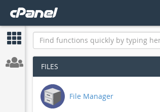

## Apa itu cPanel?

**cPanel** adalah sebuah control panel [web hosting](https://id.wikipedia.org/wiki/Webhosting "Webhosting") pada [Linux](https://id.wikipedia.org/wiki/Linux "Linux") yang memberikan tampilan grafis dan peralatan automasi yang dibuat untuk memudahkan proses [hosting](https://id.wikipedia.org/wiki/Hosting "Hosting") di sebuah [situs web](https://id.wikipedia.org/wiki/Situs_web "Situs web"). cPanel menggunakan 3 tingkat struktur untuk memberikan fungsi administrator, agen, dan pemilik situs web untuk mengatur berbagai macam aspek dari situs web dan administrasi server melalui sebuah [penjelajah web](https://id.wikipedia.org/wiki/Penjelajah_web "Penjelajah web") standar. Selain memberikan [Guide User Interface](https://id.wikipedia.org/wiki/GUI "GUI") untuk memudahkan pengguna, cPanel juga dilengkapi dengan perintah dalam teks dan berdasarkan [API](https://id.wikipedia.org/wiki/API "API") agar vendor perangkat lunak pihak ketiga, organisasi [web hosting](https://id.wikipedia.org/wiki/Webhosting "Webhosting") dan pengembang untuk automasi sistem standar proses administrasinya. [Wikipedia](https://id.wikipedia.org/wiki/Laravel)

## Bagaimana cara mengupload project Laravel ke cPanel?

Adapun caranya yaitu :

1. **Login ke cPanel** Pertama kita login ke cPanel terlebih dahulu
2. **Pilih "File Manager" pada menu cPanel** Tampilan pada file manager :
3. **Upload Project Laravel** Sebelum kita melakukan upload, kita harus mengkompres project folder kita menjadi satu file (zip atau sejenisnya). Lakukan kompresi file dengan cara klik kanan dan kemudian pilih menu compress, atau dengan menggunakan tool yang kalian pakai sendiri Tunggu beberapa saat, maka nanti akan muncul file yg berekstensi zip Kemudian klik menu Upload Kemudian kita akan dialihkan ke halaman untuk mengupload file yang telah kita buat tadi Lalu klik tombol "Select File", dan kemudian cari file project tadi Dan kemudian klik tombol "Open", lalu kita tunggu hingga proses upload selesai
4. **Ekstrak file project** Setelah proses upload selesai, kembali ke File Manager. Dan kemudian pilih file project yang sudah kita upload tadi, lalu klik kanan dan pilih menu ekstrak Lalu akan muncul dialog untuk meletakkan project kita, disini kita akan mengekstrak isi dari file zip kedalam folder "klas\_url\_shortener" Lalu klik tombol "Ekstract File(s)"
5. **Copy isi folder public pada project ke dalam folder public\_html pada direktori home** Copy semua isi folder public pada direktori project laravel yang kita buat ke dalam folder public\_html pada directory user cpanel kita.
6. **Edit file index.php pada folder public\_html** Klik kanan file index.php pada directory public\_html, lalu klik edit. Setelah itu kamu akan diarahkan ke halaman editor file. Pada saat ini kita hanya merubah 2 baris saja. Yaitu, merubah arah direktori ke arah direktori project kita yang kita upload tadi.
7. **Konfigurasi database**
8. **Ubah konfigurasi environment pada file .env**
9. **Dan selesai**
