## **Pengertian Network Scanning**

Network scanning merupakan cara yang digunakan untuk melakukan scanning pada mesin jaringan, baik itu untuk mendapatkan IP, Port, Packet data yang keluar masuk melalui jaringan, termasuk merekam aktifitas browsing, yang tentunya terdapat password dan username.

## **Jenis Jenis Network Scanning**

- Connect scan (-sT) Jenis scan ini connect ke port sasaran dan menyelesaikan three-way handshake (SYN, SYN/ACK, dan ACK). Scan ini mudah terdeteksi oleh sistem sasaran._Percobaan_ 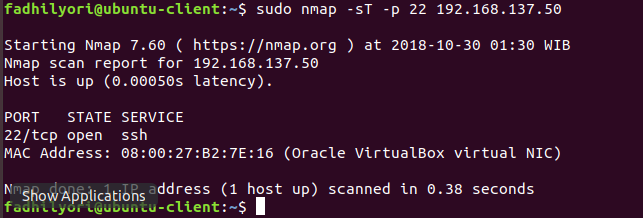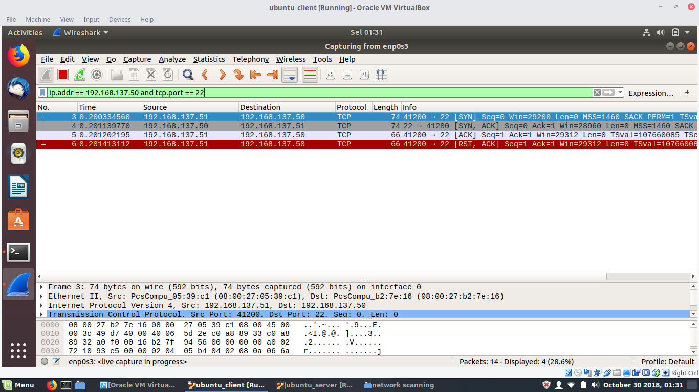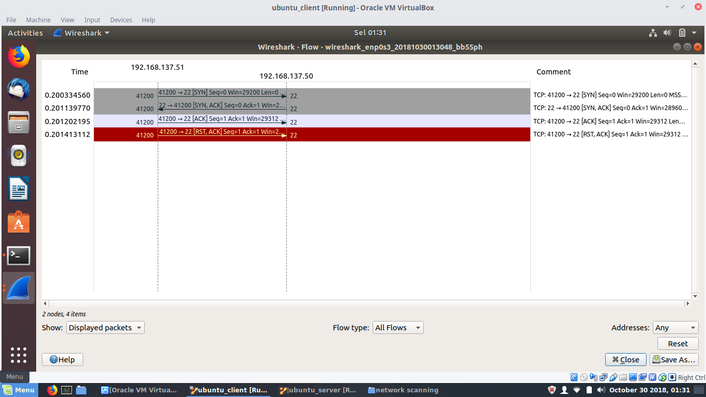
- **TCP SYN Scan (-sS)** 

Paling populer dan merupakan scan default nmap. SYN scan juga sulit terdeteksi karena tidak menggunakan 3 way handshke secara lengkap, yang disebut dengan teknik Half Open Scanning. SYN scan juga efektif karena dapat membedakan 3 state port yaitu open, filterd ataupun close. Teknik ini dikenal sebagai half open scanning karena suatu koneksi penuh TCP tidak sampai terbentuk. Sebaliknya suatu paket SYN dikirimkan ke port sasaran. Bila SYN/ACK diterima port sasaran, kita dapat mengambil kesimpulan bahwa port itu berada dalam status LISTENING. Suatu RST/ACT akan dikirim oleh mesin yang melakukan scanning sehingga koneksi penuh tidak akan terbentuk. Teknik ini bersifat siluman dibandingkan TCP connect penuh, dan tidak ada tercatat pada log sistem sasaran.

_Percobaan 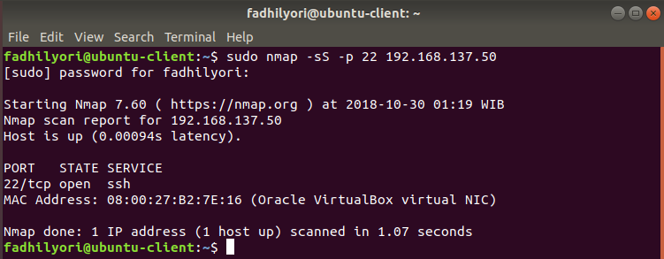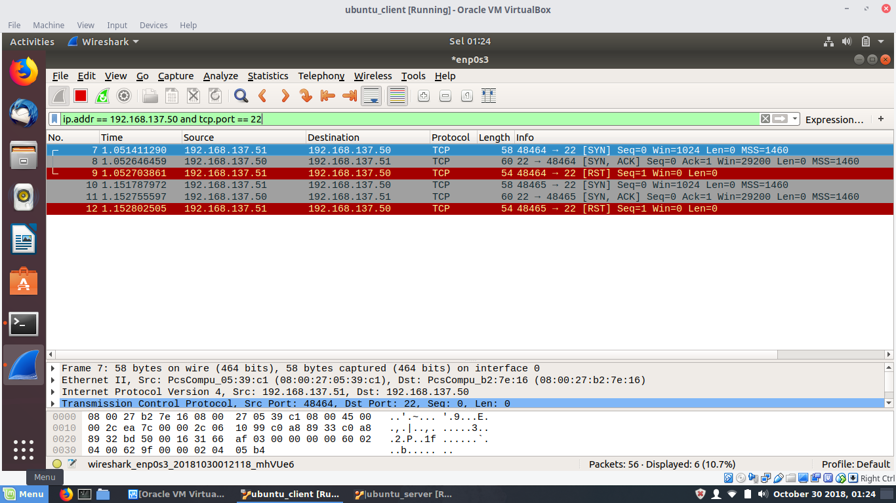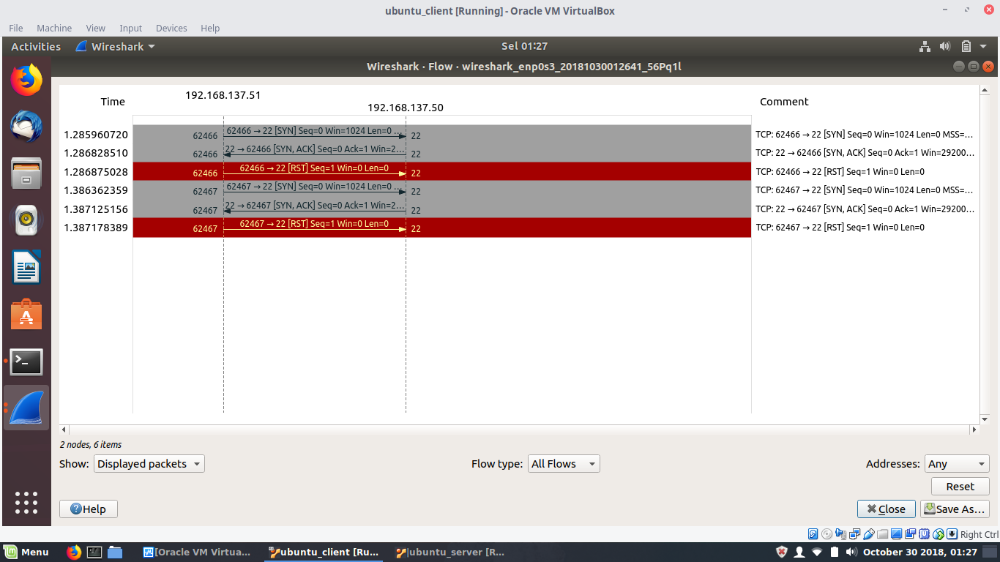_ 

- TCP FIN (-sF) Teknik ini mengirim suatu paket FIN ke port sasaran. Berdasarkan RFC 793, sistem sasaran akan mengirim balik suatu RST untuk setiap port yang tertutup. Teknik ini hanya dapat dipakai pada stack TCP/IP berbasis UNIX. __Percobaan 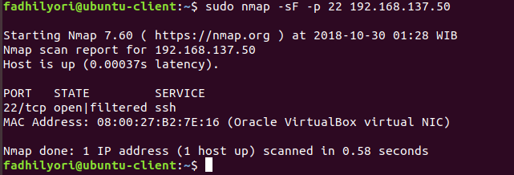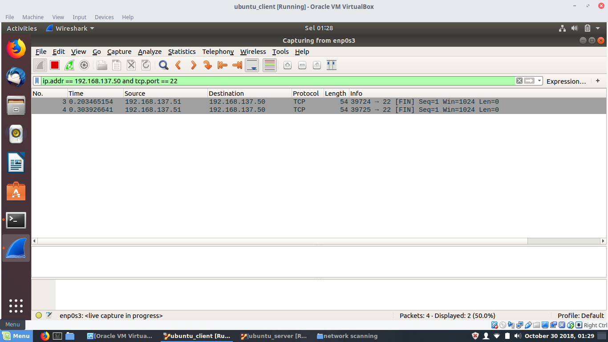__  
- **TCP Xmas Tree Scan (-sX)** Teknik ini mengirimkan paket FIN, URG dan PUSH ke port sasaran. Berdasarkan RFC 739, sistem sasaran akan mengembalikan suatu RST untuk semua port yang tertutup. _Percobaan_ 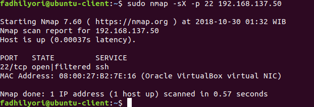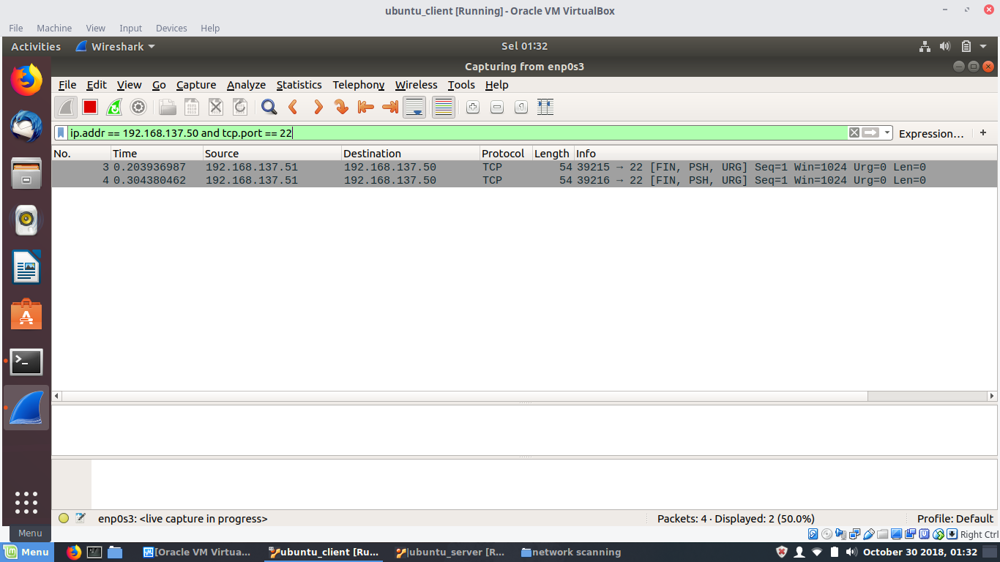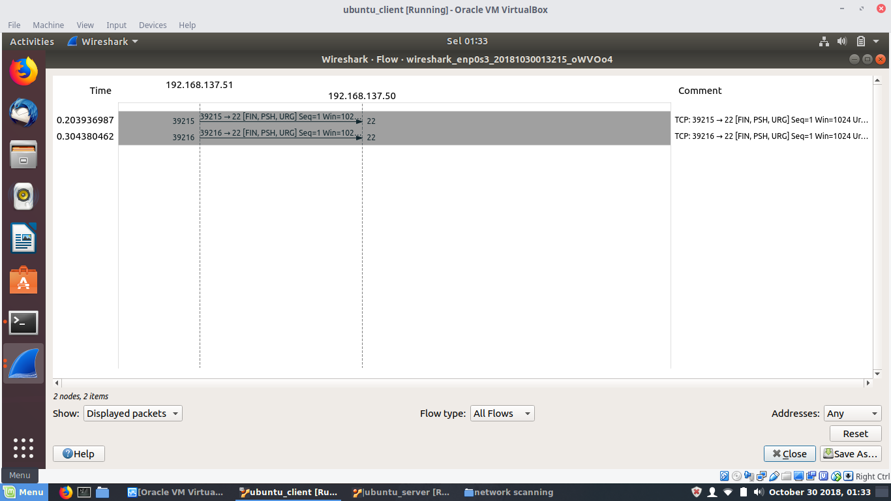
- **TCP Null (-sN)** Teknik ini membuat off semua flag. Berdasarkan RFC 793, sistem sasaran akan mengirim balik suatu RST untuk semua port yang tertutup. _Percobaan_ 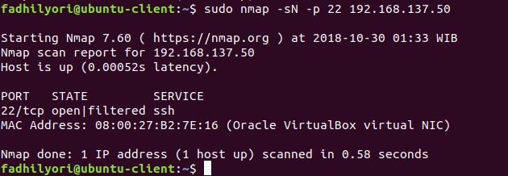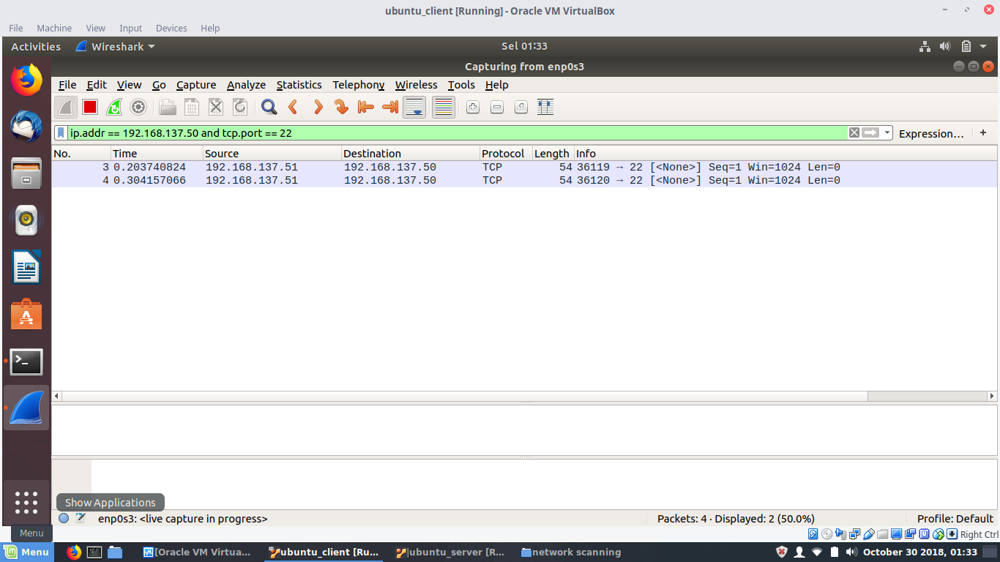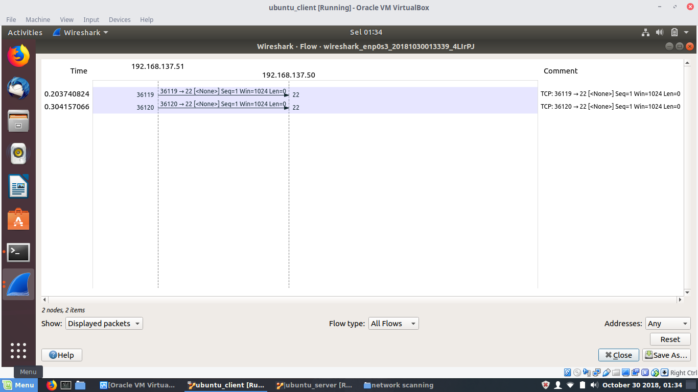
- **TCP ACK scan (-sA)** Teknik ini digunakan untuk memetakan set aturan firewall. Dapat membantu menentukan apakah firewall itu merupakan suatu simple packet filter yang membolehkan hanya koneksi-koneksi tertentu (koneksi dengan bit set ACK) atau suatu firewall yang menjalankan advance packet filtering.
- **TCP Windows Scan (-sW)** Teknik ini dapat mendeteksi port-port terbuka maupun terfilter atau tidak pada sistem-sistem tertentu (sebagai contoh : AIX dan FreeBSD) sehubungan dengan anomali dari ukuran windows TCP yang dilaporkan.

- **TCP RPC Scan (-sR)** Teknik ini spesifik hanya pada system UNIX dan digunakan untuk mendeteksi dan mengidentifikasi port RPC (Remote Procedure Call) dan program serta nomor versi yang berhubungan dengannya.
- **UDP Scan (-sU)** Teknik ini mengirimkan suatu paket UDP ke port sasaran. Bila port sasaran memberikan respon berupa pesan (ICMP port unreachable) artinya port ini tertutup. Sebaliknya bila tidak menerima pesan diatas, kita dapat menyimpulkan bahwa port itu terbuka. Karena UDP dikenal sebagai connectionless protocol, akursai teknik ini sangat bergantung pada banyak hal sehubungan dengan penggunaan jaringan dan sistem resource.

Kemudian kita disini akan dilakukan scanning dengan tipe TCP SYN Scan (-sS) dan TCP Xmas Tree Scan (-sX).
