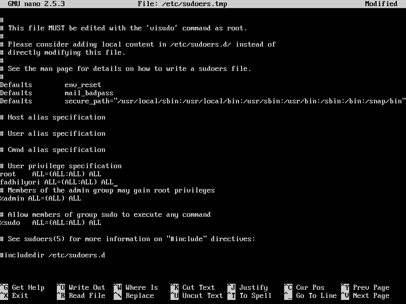
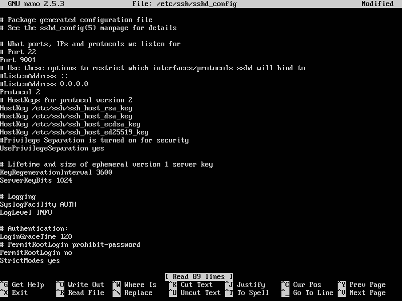
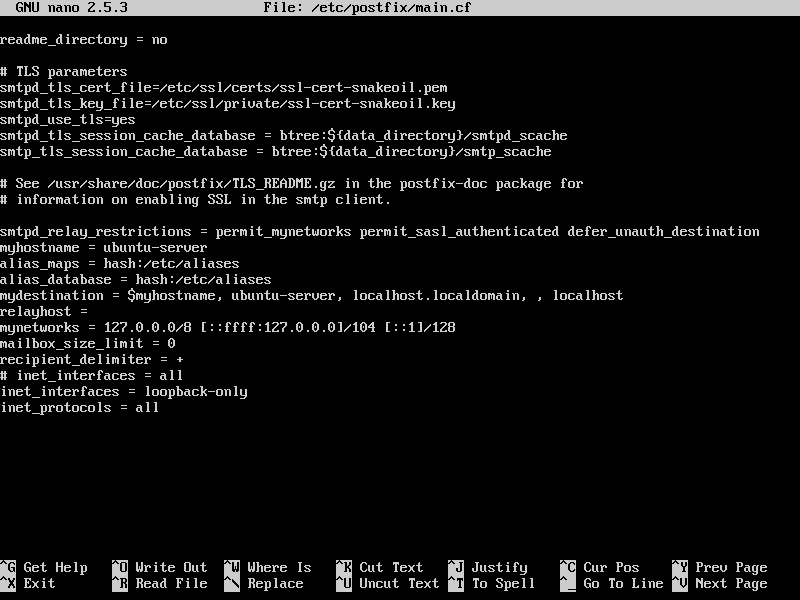

## Pengertian Hardening Host

Host Hardening adalah prosedur yang meminimalkan ancaman yang datang dengan mengatur konfigurasi dan menonaktifkan aplikasi dan layanan yang tidak diperlukan. Instalasi firewall, instalasi antivirus, menghapus cookie, membuat password , menghapus program yang tidak diperlukan itu semua termasuk dalam Host Hardening.

Tujuan dari Host Hardening adalah untuk menurunkan resiko ancaman serangan atau menutup lubang keamanan yang ada pada sebuah komputer, hal ini biasanya dilakukan dengan menghapus semua program/file yang tidak diperlukan atau dengan cara melakukan konfigurasi pada layanan yang sedang digunakan atau sedang berjalan.

## **Elemen-elemen Hardening Host**

Berikut ini merupakan elemen elemen dari Host Hardening

1. **Security Policy**

Security Policy terbagi menjadi berbagai bidang berdasarkan penggunaannya, bidang bidang itu antara lain:

Policy penggunaan computer.

1. Tidak boleh meminjamkan account kepada orang lain.
2. Tidak boleh mengambil/menaruh file dari komputer kantor, dll.

Policy penggunaan Installasi program.

1. Tidak boleh menginsall program tanpa seijin staff IT.
2. Tidak boleh menginsall program ilegal, dll.

Policy penggunaan Internet

1. Tidak boleh menggunakan internet untuk kegiatan carding, hacking d
2. Tidak boleh menggunakan internet untuk mengakses situs-situs yang berpotensi menyebarkan virus, dll.

Policy penggunaan Email

1. Tidak boleh menggunakan email kantor untuk kegiatan milis, dll.

2. **Cryptografi**

Kriptografi (cryptography) adalah ilmu dan seni menyimpan suatu pesan secara aman

1. Enkripsi dan Dekripsi
2. Cryptografi Symetric
3. Cryptografi Asymetric

3. **Firewall**

Firewall tersusun dari aturan aturan yang ditetapkan baik terhadap hardware, software maupun sistem itu sendiri, ini dilakukan dengan tujuan untuk melindungi komputer dalam jaringan, baik dengan melakukan filterasi, membatasi ataupun menolak suatu permintaan koneksi dari layanan luar jaringan seperti internet.

4. **IDS (Intrusion Detection System)**

Satu cara umum melakukan otomatisasi pada pengawasan penyusupan adalah dengan menggunakan IDS. IDS akan mendeteksi jenis serangan dari “signature” atau “pattern” pada aktifitas jaringan. Bahkan dapat melakukan blokade terhadap traffic yang mencurigakan.

5. **Backup**

Proses membuat data cadangan dengan cara menyalin atau membuat arsip data komputer sehingga data tersebut dapat digunakan kembali apabila terjadi kerusakan atau kehilangan. Backup memiliki dua tujuan. Tujuan utama adalah untuk mengembalikan data apabila data tersebut hilang, baik karena terhapus atau karena rusak (corrupt). Tujuan kedua adalah untuk mengembalikan data ke titik tertentu pada masa lalu. Karena fungsinya, proses backup mengharuskan pengguna menggandakan data, yang akhirnya menghabiskan kapasitas media penyimpanan. Ini mendorong ditemukannya teknologi-teknologi untuk mengefesienkan penyimpanan data backup, misalnya deduplikasi dan kompresi.

6. **Audit System**

Bentuk pengawasan dan pengendalian dari infrastruktur teknologi informasi secara menyeluruh. Audit teknologi informasi ini dapat berjalan bersama-sama dengan audit finansial dan audit internal, atau dengan kegiatan pengawasan dan evaluasi lain yang sejenis. Pada mulanya istilah ini dikenal dengan audit pemrosesan data elektronik, dan sekarang audit teknologi informasi secara umum merupakan proses pengumpulan dan evaluasi dari semua kegiatan sistem informasi dalam perusahaan itu. Istilah lain dari audit teknologi informasi adalah audit komputer yang banyak dipakai untuk menentukan apakah aset sistem informasi perusahaan itu telah bekerja secara efektif, dan integratif dalam mencapai target organisasinya.

7. **Digital Forensik**

Digital forensik berkaitan dengan :

1. Pengecekan koneksi aktif
2. Pengecekan listening port pasca insiden
3. Pengecekan proses yang aktif pasca insiden
4. Pengecekan log user yang login
5. Pengecekan log system
6. Pengecekan log pengakses service, dll

## Langkah - langkah Hardening Host

1. **Membuat user non-root (user biasa)** Buat sebuah user biasa atau non-root, yaitu dengan menggunakan perintah : `# adduser {namauser}` . Contohnya, `# adduser yori`​. Kemudian masukkan password untuk user tersebut dan masukkan identitas tambahan (optional).
    
    \[caption id="attachment\_39" align="alignnone" width="800"\] Add new user\[/caption\]
2. **Menambahkah user non-root ke dalam grup** _**sudoers**_ Pada step ini, kita akan menambahkan user yang kita buat sebelumnya kedalam grup sudoers. Grup sudoers ini merupakan sebuah grup pada debian & turunannya, dimana jika user tergabung pada grup ini maka user tersebut dapat menjalankan perintah `sudo` . Caranya dengan mengetik perintah `# visudo` dan kemudian tambahkan baris `{username} ALL=(ALL) ALL` pada bagian bawah dari `root ALL=(ALL) ALL`. Atau dengan mengetik perintah `# adduser {username}`.
    
    \[caption id="attachment\_40" align="alignnone" width="800"\] Menambahkan user non-root ke dalam grup sudoers\[/caption\]
3. **Membuat ssh key pada user non-root** Membuat key ssh untuk user non-root yang kita buat pada step sebelumnya. Untuk membuat ssh key, dapat dilakukan dengan mengetik perintah `$ ssh-keygen -b 4096 -t rsa`.
    
    \[caption id="attachment\_46" align="alignnone" width="616"\] Create new ssh key to current user\[/caption\]
4. **Menutup akses trafik yang masuk dengan firewall** [**ufw**](https://en.wikipedia.org/wiki/Uncomplicated_Firewall) Pada step ini, kita akan mengganti pengaturan default pada firewall ufw. Memblokir trafik yang mengarah ke dalam : `$ sudo ufw default deny incoming`. Membuka akses trafik ke luar `$ sudo ufw default allow outgoing` . Sebelum itu kita aktifkan service ufw dengan mengetik perintah `$ sudo ufw enable`.
    
    \[caption id="attachment\_47" align="aligncenter" width="421"\] Enable ufw service\[/caption\]
    
    Lalu kita ubah konfigurasi ufw dengan menggunakan perintah yang telah dijelaskan diatas.
    
    \[caption id="attachment\_48" align="aligncenter" width="448"\] Mengganti konfigurasi ufw\[/caption\]
    
5. **Membuka port yang dibutuhkan dengan firewall** [**ufw**](https://en.wikipedia.org/wiki/Uncomplicated_Firewall) Pada langkah ini, merupakan lanjutan dari langkah sebelumnya. Yaitu, kita akan mengecualikan service - service yang tidak kita inginkan untuk ikut terblokir oleh ufw. Kita dapat menggunakan perintah : `$ sudo ufw allow {nama_service}`
    
    \[caption id="attachment\_49" align="aligncenter" width="333"\] Mengijinkan ssh port\[/caption\]
6. ****Menyalin public ssh key dari client ke dalam server untuk dapat login ssh tanpa perlu menggunakan password**** Pada step ini, kita lakukan dari sisi client. Step ini, kita akan mennyalin ssh key public yang dibuat pada client ke dalam server kita. Hal ini berguna agar client yang terdaftar dapat login dengan tanpa menggunakan password.
    
    \[caption id="attachment\_50" align="alignnone" width="735"\] Perintah ssh copy dari client\[/caption\]
7. **Menyetel konfigurasi ssh untuk menonaktifkan login root** Pada langkah ini, menjelaskan tentang bagaimana mencegah login ke user root menggunakan ssh.  Adapun caranya yaitu, edit file /etc/ssh/sshd\_config. Ubah PermitRootLogin menjadi no.
    
    \[caption id="attachment\_51" align="alignnone" width="800"\] Mencegah login root pada ssh\[/caption\]
8. **Mengganti port ssh** Mengganti port ssh dapat mempersulit dalam login dengan ssh. Pada saat ini, saya mengganti port ssh menjadi 9001.
    
    \[caption id="attachment\_52" align="alignnone" width="800"\] Change port ssh\[/caption\]
9. **Menginstall unattended upgrades** Menginstall paket ini adalah untuk penambahan update sekuritas tambahan.
    
    \[caption id="attachment\_53" align="aligncenter" width="645"\] Install unattended upgrade\[/caption\]
10. **Menginstall postfix untuk dapat menggunakan layanan email**
    
    \[caption id="attachment\_54" align="aligncenter" width="764"\] Install postfix\[/caption\]
    
    \[caption id="attachment\_58" align="alignnone" width="800"\] Konfigurasi postfix\[/caption\]
11. **Menginstall logswatch untuk mengirim rangkuman melalui email tentang kondisi host**
    
    \[caption id="attachment\_55" align="alignnone" width="800"\] Install Logwatch\[/caption\]
    
    \[caption id="attachment\_59" align="alignnone" width="800"\] Konfigurasi logwatch untuk mengirim email setiap 7 hari\[/caption\]
12. **Menggunakan fail2ban untuk mengatasi serangan login ssh menggunakan metode Brute-Force**
    
    \[caption id="attachment\_56" align="aligncenter" width="800"\] Install fail2ban\[/caption\]
    
    \[caption id="attachment\_57" align="alignnone" width="800"\] Konfigurasi fail2ban\[/caption\]
13. **Mengkonfigurasi timezone menggunakan UTC dan menginstall NTP**
    
    \[caption id="attachment\_60" align="alignnone" width="800"\] Set timezone to UTC & Install NTP\[/caption\]
14. **Secure shared memory**
    
    \[caption id="attachment\_61" align="alignnone" width="800"\] fstab file\[/caption\]
15. **Menambahkan baner login**
    
    \[caption id="attachment\_62" align="alignnone" width="800"\] Add banner login\[/caption\]
16. **Memperkuat pada sisi network**
    
    `$ nano /etc/sysctl.conf`​
    
    cari net.ipv4.ip\_forward=1 perhatikan tanda # dan hapuskan 2 tanda #
    
    lalu kemudian cari net.ipv4.all.accept\_source\_route=0 dan net.ipv6.all.accept\_source\_route=0
    
    perhatikan tanda # dan hapuskan 2 tanda # keduanya
    
17. ****Mencegah IP Spoofing****
    
    Konfigurasikan spoof dengan menambahkan atau mengedit pada baris di paling bawah.
    
    `$ sudo nano /etc/host.conf`
    
    \[caption id="attachment\_63" align="alignnone" width="800"\] Prevent ip spoofing\[/caption\]
