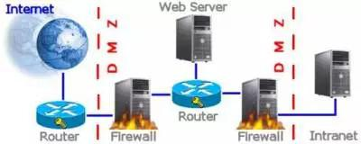

**A) Pengertian Firewall**

Firewall adalah sebuah perangkat keras atau perangkat lunak atau kombinasi dari keduanya yang didesain untuk mencegah akses yang tidak sah menuju atau dari jaringan lokal/pribadi dengan cara memperhatikan jenis lalu lintas atau dengan sumber atau alamat tujuan dan port. Firewall memeriksa semua informasi yang masuk atau keluar dari intranet dan memblokir yang tidak memenuhi kriteria keamanan yang telah ditentukan. Firewall ditempatkan di titik persimpangan atau gateway antara 2 jaringan, yang biasanya merupakan jaringan pribadi dan jaringan publik seperti internet.

  Gambar 1.1

Sumber : https://nailahmumtazahfarzan.wordpress.com/2014/03/31/tipe-firewall

2. **Arsitektur Firewall** 1\. Bastion Host
    

  Gambar 1.2

Sumber : http://1337pak.blogspot.com/2013/03/ceh-v7-pdf.html

Bastion host merupakan sebuah sistem komputer yang dirancang dan dikonfigurasi untuk melindungi sumber daya jaringan dari serangan. Lalu lintas jaringan yang akan memasuki atau meninggalkan jaringan akan melewati firewall, dimana firewall ini memiliki 2 interface, yaitu: interface publik dan interface privat. Interface publik adalah interface yang terhubung langsung dengan jaringan internet (jaringan luar). Sedangkan jaringan privat adalah interface yang terhubung ke intranet (jaringan dalam).

2\. Screened Subnet

Screened Subnet atau DMZ (DeMilitarized Zone) berisi komputer host yang menawarkan layanan publik. Zona publik terhubung langsung dengan internet dan tidak ada host yang dikontroll oleh organisasi. Sedangkan, zona privat mempunyai sistem yang bagi pengguna internet tidak memiliki akses bisnis kedalamnya.

3\. Mutli-homed Firewall

Pada kasus ini, terdapat lebih dari 3 interface yang digunakan yang memungkinkan pengelompokan sistem lebih lanjut berdasarkan tujuan keamanan spesifik dari organisasi.

3. **DeMilitarized Zone (DMZ)**
    

DeMilitarized Zone (DMZ) adalah sebuah network yang berfungsi sebagai penyangga antara jaringan aman internal dan jaringan tidak aman internet. DMZ dibuat menggunakan firewall dengan tiga atau lebih antarmuka jaringan yang ditugaskan dengan peran tertentu seperti jaringan terpercaya (jaringan internal), jaringan DMZ, dan jaringan tidak dipercaya (jaringan internet)

3. **Jenis Firewall**
    

3. 1. Packet Filters
        

3. 2. Circuit Level Gateways
        

3. 3. Stateful Multilayer Inspection Firewalls
        

3. 4. Application Level Gateways
        

Topologi

**Percobaan**

1. Setting Guest OS 1
    1. enp0s3 : 10.0.2.15/24
        
    2. enp0s8 : 192.168.137.50/24
        
        
        

2. Setting NAT  
    
3. Setting Guest OS 2
    
    1. enp0s3 : 192.168.137.51/24  
        
    2. Tambah default gateway  
        
    3. Ping keluar 
