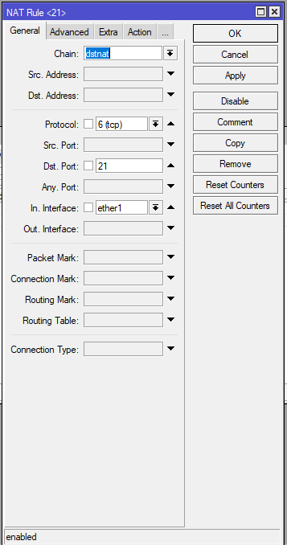
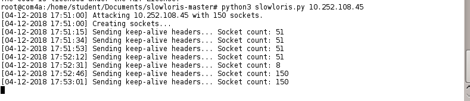

- **PENDAHULUAN**

**IP Forwarding**

_IP Forwarding_ merupakan kondisi di mana router meneruskan paket data yang diterimanya pada suatu interface (kartu jaringan / eth) ke interface yang lain sesuai tujuan paket, jadi IP Forward adalah syarat pokok untuk membuat gateway. (Molavi Arman:2018).

**Web Server**

Web server adalah sebuah software yang memberikan layanan berbasis data dan berfungsi menerima permintaan dari HTTP atau HTTPS pada klien yang dikenal dan biasanya kita kenal dengan nama web browser (Mozilla Firefox, Google Chrome) dan untuk mengirimkan kembali yang hasilnya dalam bentuk beberapa halaman web dan pada umumnya akan berbentuk dokumen HTML.

Gambar 1. Cara Kerja Web Server

Pada gambar 1 saat mengambil halaman website, browser mengirimkan permintaan ke server yang kemudian diproses oleh web server. HTTP request dikirimkan ke web server. Sebelum memproses HTTP request, web server juga melakukan pengecekan terhadap keamanan. Pada web server, HTTP request diproses dengan bantuan HTTP server. Kemudian web server mengirimkan HTTP response ke browser dan memprosesnya menjadi halaman situs web.

- **Rumusan Masalah**

1. Apa itu IP Forwarding?
2. Apa itu Web Server?
3. Bagaimana cara melakukan konfigurasi IP Forwarding pada mikrotik?
4. Bagaimana cara menginstal FTP Server?

- **Tujuan**

1. 1. Memahami cara kerja IP Forwarding
    2. Memahami cara menyiapkan web server
    3. Memahami cara melakukan konfigurasi pada mikrotik
    4. Memahami cara membuat FTP Server sendiri

- **PERCOBAAN**

**Konfigurasi Mikrotik**

1. Setelah membuka Mikrotik atur dan sesuaikan IP dengan klik IP > Address isikan sesuai dengan di bawah ini kemudian klik Apply & Ok jika dirasa sudah benar.

**Gambar 1. Setting IP.**

1. Setting DHCP Setup

**Gambar 2. Memilih interface pada DHCP Setup.**

**Gambar 3. Menyesuaikan Address space disini saya maksimalkan penggunaan IP menjadi /24.**

**Gambar 4. Menyesuaikan gateway untuk network.**

**Gambar 5. Pada DHCP Relay disini dikosongi saja dengan klik tombol arah atas.**

**Gambar 6. Hasil akhir jika DHCP Setup telah berhasil di setting.**

3. Setting pada Quick Set lalu jangan lupa untuk mengganti Quick Set menjadi Home AP

**Gambar 7. Quick Set**

Pada bagian Wireless ubah Network Name (Opsional), Frequency, Country, WiFi Password. Pada Internet sesuaikan  IP Address, Netmask, Gateway, centang pada Firewall Router. Pada Local Network isikan IP Address, Netmask, centang DHCP Server, masukkan DHCP Server Range mulai dari 192.168.3.4 karena 192.168.3.2 & 192.168.3.3 digunakan sebagai Web Server dan FTP, centang NAT & UPnP.

4. Sesuaikan Firewall. dengan settingan yang sama tapi mengubah port, buat port menjadi 21 & 20 untuk TCP dan 20 untuk UDP.

**Gambar 8. Ketika membuka firewall pilih tab NAT lalu pilih +. Ubah chain, Protocol, Dst. Port 21 untuk TCP dan In Interface.**

**Gambar 9. Ketika membuka firewall pilih tab NAT lalu pilih +. Ubah chain, Protocol, Dst. Port 20 untuk TCP dan In Interface.**

**Gambar 10. Tab Action & sesuaikan Action, To Addresses dan To Ports 21**

**Gambar 11. Tab Action & sesuaikan Action, To Addresses dan To Ports 20**

**Gambar 12. Ketika membuka firewall pilih tab NAT lalu pilih +. Ubah chain, Protocol, Dst. Port 20 untuk UDP dan In Interface.**

**Gambar 13. Tab Action & sesuaikan Action, To Addresses dan To Ports 20**

## **Web Server**

1. Pastikan Anda sudah menginstal apache2Install Apache2 dengan perintah # apt-get install apache2
2. Start Apache2 untuk menjalankan apache2 Jalankan Apache2 dengan perintah # systemctl start apache2
3. Buat halaman html pada /var/www/html# Membuat halaman Web pada direktori _/var/www/html_\# nano index.html Isi script berikut<html> <head></head> <body> <h1>Webserver Kelompok 3</h1> 
2103161031 Ayu Lestari
 
2103161034 Venny Diski Habsari
 
2103161035 Fridastya Andini Pamudyaningrum
 
2103161037 Fadhil Yori Hibatullah
 </body> </html>
4. Ubah IP menjadi static, lalu restart  ****Gambar 14. Mengubah IP ke Static****Untuk mengubah IP menjadi static kita harus masuk ke direktori /etc/network/interfaces. Untuk web server kita menggunakan address/IP 192.168.3.3**Restart Networking**Agar IP nya berubah maka harus dilakukan restart terhadap network dengan perintah : # service networking restart
5. Coba cek IP ** Gambar 15. Mengecek IP ** Mengecek IP menggunakan perintah _dhclient -v_. Apakah IP sudah sama dengan yang kita buat tadi.
6. Cek di browser pada PC lain http://localhost ** **  Gambar 16-17. Mengecek Webserver yang Sudah Dibuat di Client****Untuk mengecek apakah webserver yang sudah kita buat berhasil, maka harus di coba di komputer client yang lain. Jika berhasil maka akan muncul halaman yang sudah kita buat tadi, bisa dilihat di **Gambar** **20-21.**

 

## **FTP Server**

1. 1. Atur IP Address sesuai kelompok. **** Gambar 18. Mengatur IP Address melalui /etc/network/interfaces****
    2. Pastikan Anda menginstal proftpd apt-get install proftpd  ****Gambar 19. Proses instalasi proftp sedang berlangsung****
    3. Setelah selesai instalasi proftpd, muncul sebuah dialog. Pilih standalone. Lalu, pilih ok. **** Gambar 20. Dialog yang muncul setelah instalasi****
    4. Lalu, edit file proftpd.conf.nano /etc/proftpd/proftpd.conf  **Gambar 21. Mengubah ServerName pada proftp.d.conf** ** Gambar 22. Mengubah DefaultRoot dan memastikan port 21 pada proftp.d.conf**
    5. Kemudian pindah ke directory /home/hostnameanda/cd /home/student
    6. Kemudian buat sebuah folder. Buatlah sebuah user yang nantinya bisa mengakses folder tersebut melalui ftp. mkdir ftpchmod 777 ftp/cd ftpuseradd kel3
        
        passwd kel3  **Gambar 23. Pembuatan folder yang akan diakses pada ftp**
        
         
    7. Kemudian, cek di ftp://10.252.108.43 dan masuk dengan username dan password yang telah dibuat tadi. Dari komputer server, buatlah sebuah folder yang akan menguji apakah ftp tersebut tersambung atau tidak.  ****Gambar 24. Login ke ftp****
    8. Jika berhasil masuk ke ftp, maka akan muncul tampilan seperti ini.  **Gambar 25. Direktori yang diakses melalui ftp**

 

## **Konfigurasi SQLMap**

1. Install SqlMap  **Gambar 26. Menginstal Sqlmap dengan perintah** **_apt-get install sqlmap_**
2. Mencoba nmap di PC lain ** Gambar 27. Mencoba nmap IP 41 dengan perintah** ****_nmap \[IP Client\]_****Pada keterangan gambar diatas diketahui pada port 21, port 23, port 53, port 80, dan port 2000 sedang terbuka pada komputer yang memiliki IP 41.

**Konfigurasi Slowloris**

1. Download paket slowloris-master, lalu ikuti cara berikut  **** Gambar 28. Mengkonfigurasikan Slowloris****Untuk menjalankan slowloris kita harus masuk ke folder slowloris-master lalu kita coba untuk melihat isi dari file README.md untuk mengetahui cara menjalankan slowlorisnya.
2. Menyerang ke IP 45 ** ** Gambar 29. Menyerang IP 45****Untuk menyerang kita menggunakan perintah _python3 slowloris.py \[ip yang akan diserang\]._ Jika berhasil maka akan muncul hasil seperti **Gambar 29.** Komputer yang kita serang akan melakukan buffering.

- **KESIMPULAN**

Pada praktikum ini, port ftp dan webserver yang dideteksi terbuka melalui scanning nmap akan diserang oleh client sehingga tidak bisa dibuka. Pada praktikum ini mempelajari bagaimana melakukan konfigurasi pada ftp dan webserver dan apa yang terjadi kepada server apabila mengalami serangan.

- **REFERENSI**

https://www.molaviarman.net/ip-forwarding-pada-debian-dan-sharing-internet/

https://idcloudhost.com/pengertian-web-server-dan-fungsinya/

https://www.danuzard.web.id/2015/09/konfigurasi-ftp-proftpd-ubuntu-server.html?m=1
