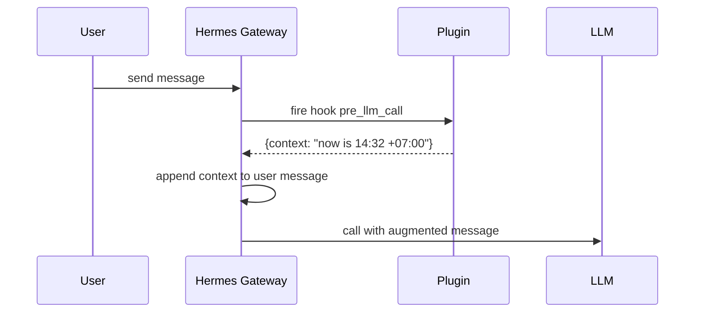

## TL;DR

I built a [`time_awareness`](https://github.com/fadhilyori/fadhilyori-hermes-plugins/tree/main/time_awareness) plugin for [Hermes Agent](https://hermes-agent.nousresearch.com/). The job is simple: inject accurate local time into the LLM context on every conversation turn. The plugin is open-source and free for anyone to use.

> **Repository:** [github.com/fadhilyori/fadhilyori-hermes-plugins](https://github.com/fadhilyori/fadhilyori-hermes-plugins)
> **Plugin:** [`time_awareness`](https://github.com/fadhilyori/fadhilyori-hermes-plugins/tree/main/time_awareness)
> **Stack:** Python 3.11+, `zoneinfo`, `pre_llm_call` hook

---

## Core problem: LLMs are stateless

If you've ever used an LLM via the raw API, without any orchestration layer, you'll notice one thing: **the model has no clock**. There's no background process ticking off seconds, no signal sent every minute to the model. The model is never "woken up" and asked "what time is it?".

LLMs are pure functions: input becomes output. Give them context, and they answer based on that context. If the context doesn't carry time information, they answer without time, or worse, **fabricate** time based on assumptions from their training data.

For a casual chatbot that only gets asked "what's 2+2?", that's fine. But the moment you ask an agent for anything *time-sensitive*, the foundation cracks:

- **Scheduling and calendars.** "Schedule a meeting tomorrow at 10 AM" — but tomorrow is when, from whose perspective?
- **Logs and audit trails.** A log entry without an accurate timestamp can't be root-caused.
- **Stocks and capital markets.** "Has the market opened yet?" without *real-time* data becomes guesswork.
- **Cron and scheduled tasks.** An agent that doesn't know the time can't verify whether it missed a deadline or fired too early.
- **Tone calibration.** A response at 3 AM should read differently from one at 3 PM.

## What Hermes Agent already provides (and doesn't)

Hermes Agent, the runtime I use every day, is already fairly clever about this. At the start of a session, it injects a single line into the system prompt:

```text {linenos=false}
Conversation started: Friday, July 12, 2026
```

Good enough as *bootstrap*. The agent knows "okay, this session started on date X." But there's one thing I only realized after weeks of use:

> That timestamp is **static**. It's injected once when the session begins, then **never refreshed**.

That means if I open a chat at 9 PM and continue the conversation at 2 AM, the agent still thinks "Conversation started: 9 PM". Any reasoning that depends on *current time* ends up off by hours.

I needed something that **refreshes per turn**.

---

## Solution: the `pre_llm_call` hook

Hermes Agent has an elegant *event hook* system. One of them, `pre_llm_call`, fires once at the start of every turn, *before* the tool call loop begins. The hook receives the session payload and can return a `{"context": "..."}` string that gets appended to the user message.

Flow diagram:



The important thing here: **the context is injected into the user message, not the system prompt**. This is *by design*. A stable system prompt enables prompt caching, so if we put something that changes every turn (like time) inside it, the cache would get *invalidated* every time. That ends up costing more on the AI model. By appending to the user message, the system prompt stays stable, the cache stays warm, and the agent still has access to the latest context.

---

## Iteration 1: shell hook (June 2026)

My first implementation was a shell script, `~/.hermes/agent-hooks/inject-time.sh`. Five minutes of setup, one file, done:

```bash
#!/bin/bash
# inject-time.sh — prepend current local time to every turn
cat - >/dev/null  # discard stdin payload

TZ="${HERMES_TIMEZONE:-Asia/Jakarta}"
printf '{"context":"Current local time: %s (%s)"}\n' \
    "$(TZ=$TZ date '+%Y-%m-%dT%H:%M:%S%z %A')" \
    "$TZ"
```

Wiring in `~/.hermes/config.yaml`:

```yaml
hooks:
  pre_llm_call:
    - command: "~/.hermes/agent-hooks/inject-time.sh"
```

The results were immediately noticeable. The agent suddenly started saying "good morning" in the morning, "don't stay up late" at 2 AM, and referring to the correct date when I said "tomorrow". The change was instantly felt.

### Why start with a shell hook?

I have an unwritten rule for myself: **start with the lightest option**. A shell hook:

- **Has no dependencies.** No Python imports, no `requirements.txt`.
- **Has a clear failure mode.** If `date` fails, stderr shows up immediately in the logs.
- **Is easy to debug.** You can run it manually with `echo '{}' | ~/.hermes/agent-hooks/inject-time.sh`.
- **Is easy to roll back.** Delete one line from config, restart, done.

A Python plugin gives more power, but also more *baggage*: packaging, dependencies, more complex error handling. If a shell hook is enough, just ship it. Promote to a plugin when there's a strong reason.

---

## Iteration 2: migration to a Python plugin (July 2026)

After a month of use, two things changed:

1. **I wanted to distribute it.** A shell hook is personal configuration. Nobody wants to copy-paste a script into their own `~/.hermes/agent-hooks/`. A plugin is a unit of distribution.
2. **I wanted proper testing.** A shell script can be tested, but mocking the `TZ` env var and date formatting felt brittle. Python unit tests with `unittest` are more *predictable*.

So I dug into the official Hermes Agent docs on [Build a Hermes Plugin](https://hermes-agent.nousresearch.com/docs/developer-guide/plugins), then went ahead with the migration to a more proper plugin. The final structure:

```text {linenos=false}
hermes-plugins/
├── LICENSE                  # MIT
├── Makefile                 # make test, make list, make clean
├── README.md
└── time_awareness/
    ├── README.md
    ├── __init__.py          # register(ctx) entry point
    ├── plugin.yaml          # manifest
    ├── plugin.py            # core logic
    ├── main.py              # manual test entrypoint
    └── test.py              # unit tests
```

### `plugin.yaml`: the manifest

```yaml
name: time_awareness
version: 1.1.0
description: Simply injects time into the LLM context to help agent understand the current time.
author: fadhilyori
provides_hooks:
  - pre_llm_call
```

This manifest is what the gateway matches against at startup. If `name:` doesn't match the directory name, the plugin is silently skipped. One of the *pitfalls* I learned the hard way.

### `plugin.py`: the core logic

```python
from __future__ import annotations
import logging
from datetime import datetime

from hermes_time import get_timezone, now

logger = logging.getLogger(__name__)


def _build_context(now: datetime, tz_name: str) -> str:
    offset = now.strftime("%z")
    return (
        f"{now.strftime('%Y-%m-%dT%H:%M')}{offset[:3]}:{offset[3:]} "
        f"{now.strftime('%a')} {tz_name}"
    )


def inject_context(**kwargs) -> dict:
    try:
        tz = get_timezone()
        if tz is None:
            now_dt = now()
            tz_name = now_dt.tzname() or "local"
        else:
            now_dt = datetime.now(tz)
            tz_name = str(tz)
    except Exception:
        logger.warning("hermes_time unavailable; falling back to system local time")
        now_dt = datetime.now().astimezone()
        tz_name = now_dt.tzname() or "local"
    return {"context": _build_context(now_dt, tz_name)}
```

The output looks like this:

```text {linenos=false}
2026-07-12T14:32+07:00 Sun Asia/Jakarta
```

One line, all the info the agent needs: full ISO-style date, explicit offset, day of the week, and IANA zone name. No added text like "yesterday/tomorrow/weekend". The agent can determine that itself. I deliberately minimized the output because every extra byte accumulates over the course of a session, so I needed to economize on tokens. Especially for anyone running Hermes Agent with a local model or one with a limited *context length/window*.

### `__init__.py`: the entry point

```python
from __future__ import annotations
import logging
from . import plugin

logger = logging.getLogger(__name__)


def register(ctx) -> None:
    logger.info("registering plugin")
    ctx.register_hook("pre_llm_call", plugin.inject_context)
```

`register(ctx)` is called once at gateway startup. After that, `plugin.inject_context` fires every turn. No global state, no heavy init. Just *fire and forget*.

### Resolution order: which zone gets used?

The plugin doesn't *hard-code* a zone. It asks in this order:

1. **`HERMES_TIMEZONE` env var.** Highest priority, per-process override.
2. **`timezone` key in `~/.hermes/config.yaml`.** User-level setting.
3. **System local time.** Last-resort fallback.

```python
# Simplified from hermes_time.get_timezone()
def get_timezone():
    env_tz = os.environ.get("HERMES_TIMEZONE")
    if env_tz:
        return ZoneInfo(env_tz)

    config_tz = _read_config_timezone()
    if config_tz:
        return ZoneInfo(config_tz)

    return None  # caller falls back to system local
```

One interesting thing: if `ZoneInfo("Asia/Jakarta")` fails because tzdata isn't available, the plugin **does not crash**. It falls back to `datetime.now().astimezone()`, which uses the operating system's zone. The agent loop keeps running, and the user sees no error.

> This is a design choice: a hook failure **must not** disrupt the agent. Better to get a slightly off time than to throw an exception and abort the user's turn.

---

## Results

Now every time I chat with Hermes — on Discord, Telegram, or terminal — the agent sees something like:

```text {linenos=false}
2026-07-12T14:32+07:00 Sun Asia/Jakarta
```

in its context, fresh every turn. No matter if we've been chatting for 5 minutes or 5 hours, no matter if the timezone changes due to DST (Indonesia doesn't have it, but if I move countries, the plugin follows), no matter if I'm continuing an old session or starting a new one.

And more importantly: no more moments where the *agent* sets the wrong schedule or reminder because the model doesn't call any *tool* or command related to getting the current time, like `date`.

---

## References

- **Plugin source:** [github.com/fadhilyori/fadhilyori-hermes-plugins/tree/main/time_awareness](https://github.com/fadhilyori/fadhilyori-hermes-plugins/tree/main/time_awareness)
- **Hermes Agent docs:** [hermes-agent.nousresearch.com/docs](https://hermes-agent.nousresearch.com/docs)
- **Hook events reference:** [docs/user-guide/features/hooks](https://hermes-agent.nousresearch.com/docs/user-guide/features/hooks)
- **Plugin authoring guide:** [docs/guides/build-a-hermes-plugin](https://hermes-agent.nousresearch.com/docs/guides/build-a-hermes-plugin)
