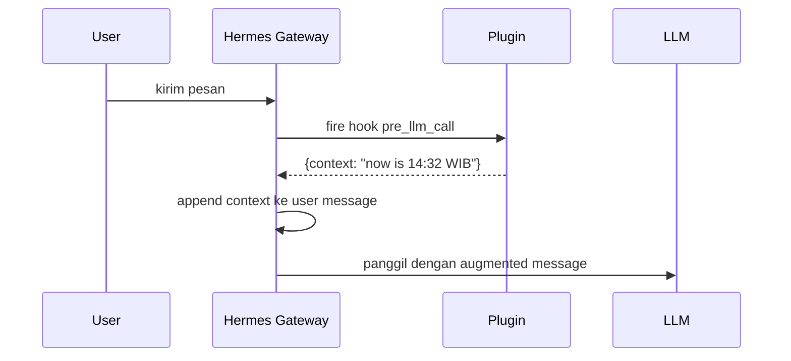

## TL;DR

Saya membuat plugin [`time_awareness`](https://github.com/fadhilyori/fadhilyori-hermes-plugins/tree/main/time_awareness) untuk [Hermes Agent](https://hermes-agent.nousresearch.com/). Tugasnya sederhana: *inject* waktu lokal yang akurat ke konteks LLM di setiap turn percakapan. Plugin ini open-source dan bebas digunakan siapa saja.

> **Repositori:** [github.com/fadhilyori/fadhilyori-hermes-plugins](https://github.com/fadhilyori/fadhilyori-hermes-plugins)
> **Plugin:** [`time_awareness`](https://github.com/fadhilyori/fadhilyori-hermes-plugins/tree/main/time_awareness)
> **Stack:** Python 3.11+, `zoneinfo`, hook `pre_llm_call`

---

## Masalah inti: LLM itu stateless

Kalau kamu pernah pakai LLM lewat API mentah, tanpa orchestration layer, kamu akan sadar satu hal: **model tidak punya jam**. Tidak ada proses latar yang menghitung detik, tidak ada sinyal yang dikirim tiap menit ke model. Model tidak pernah "dibangunkan" untuk ditanya "sekarang jam berapa?".

LLM adalah fungsi murni: input menjadi output. Berikan dia konteks, dia jawab berdasarkan konteks itu. Kalau konteksnya tidak memuat informasi waktu, dia akan menjawab tanpa waktu, atau lebih buruk lagi, **mengarang** waktu berdasarkan asumsi dari data training-nya.

Untuk chatbot kasual yang cuma ditanya "berapa 2+2?", ini tidak masalah. Tapi begitu kamu minta agent untuk hal-hal yang *time-sensitive*, fondasinya langsung goyah:

- **Jadwal dan kalender.** "Schedule meeting besok jam 10 pagi", tapi besok itu kapan, dari sudut pandang mana?
- **Log dan audit trail.** Entry log tanpa timestamp akurat tidak bisa di-root cause.
- **Stock dan pasar modal.** "Pasar sudah buka belum?" tanpa data *real-time* jadi tebak-tebakan.
- **Cron dan scheduled task.** Agent yang tidak tahu waktu tidak bisa verifikasi apakah dia melewatkan deadline atau justru terlalu cepat.
- **Tone calibration.** Respons untuk jam 3 pagi harusnya beda dengan jam 3 sore.

## Apa yang Hermes Agent sudah berikan (dan tidak)

Hermes Agent, runtime yang saya pakai sehari-hari, sudah cukup pintar soal ini. Di awal sesi, dia menyuntikkan satu baris ke system prompt:

```text {linenos=false}
Conversation started: Friday, July 12, 2026
```

Cukup bagus untuk *bootstrap*. Agent jadi tahu "oke, sesi ini mulai tanggal X." Tapi ada satu hal yang baru saya sadari setelah beberapa minggu pemakaian:

> Timestamp itu **statis**. Di-inject sekali saat sesi mulai, lalu **tidak pernah di-refresh**.

Artinya, kalau saya buka chat jam 9 malam lalu melanjutkan percakapan jam 2 pagi, agent masih berpikir "Conversation started: 9 PM". Semua reasoning yang bergantung pada *current time* jadi meleset berjam-jam.

Saya butuh sesuatu yang **di-refresh per turn**.

---

## Solusi: hook `pre_llm_call`

Hermes Agent punya sistem *event hook* yang elegan. Salah satunya, `pre_llm_call`, fire sekali di awal setiap turn, *sebelum* tool call loop dimulai. Hook ini menerima payload sesi dan bisa mengembalikan sebuah `{"context": "..."}` string yang akan di-append ke user message.

Diagram alurnya:



Yang penting di sini: **context di-inject ke user message, bukan ke system prompt**. Ini *by design*. System prompt yang stabil memungkinkan penggunaan prompt caching, sehingga apabila kita taruh sesuatu yang berubah-ubah per turn (seperti waktu) di dalamnya, itu akan meng-*invalidate* cache setiap saat. Ini tentu akhirnya berdampak pada cost model AI yg digunakan. Dengan menambahkan ke user message, system prompt tetap stabil, cache tetap hangat, dan agent tetap punya akses ke konteks terbaru.

---

## Iterasi 1: shell hook (Juni 2026)

Implementasi pertama saya adalah shell script, `~/.hermes/agent-hooks/inject-time.sh`. Lima menit setup, satu file, selesai:

```bash
#!/bin/bash
# inject-time.sh — prepend current local time to every turn
cat - >/dev/null  # discard stdin payload

TZ="${HERMES_TIMEZONE:-Asia/Jakarta}"
printf '{"context":"Current local time: %s (%s)"}\n' \
    "$(TZ=$TZ date '+%Y-%m-%dT%H:%M:%S%z %A')" \
    "$TZ"
```

Wiring di `~/.hermes/config.yaml`:

```yaml
hooks:
  pre_llm_call:
    - command: "~/.hermes/agent-hooks/inject-time.sh"
```

Hasilnya langsung terasa. Agent tiba-tiba bisa bilang "selamat pagi" di pagi hari, "jangan begadang" jam 2 pagi, dan merujuk ke tanggal yang benar saat saya bilang "besok". Perubahannya langsung berasa berdampak.

### Kenapa shell hook dulu?

Saya punya aturan tidak tertulis untuk diri sendiri: **mulai dari yang paling ringan**. Shell hook itu:

- **Tanpa dependency.** Tidak perlu Python import, tidak ada `requirements.txt`.
- **Failure mode jelas.** Kalau `date` gagal, stderr langsung kelihatan di log.
- **Gampang di-debug.** Bisa di-run manual dengan `echo '{}' | ~/.hermes/agent-hooks/inject-time.sh`.
- **Gampang di-rollback.** Hapus satu baris dari config, restart, selesai.

Plugin Python memberikan lebih banyak power, tapi juga lebih banyak *baggage*: packaging, dependency, error handling yang lebih kompleks. Kalau shell hook cukup, ship saja dulu. Promosikan ke plugin kalau ada alasan kuat.

---

## Iterasi 2: migrasi ke plugin Python (Juli 2026)

Setelah sebulan pakai, dua hal berubah:

1. **Saya mau mendistribusikan ini.** Shell hook itu konfigurasi personal. Tidak ada yang mau copy-paste script ke `~/.hermes/agent-hooks/` mereka. Plugin adalah unit distribusi.
2. **Saya mau proper testing.** Shell script bisa di-test, tapi mocking `TZ` envvar dan date formatting terasa rapuh. Unit test Python dengan `unittest` lebih *predictable*.

Jadi saya coba pelajari dokumentasi resmi Hermes Agent tentang [Build a Hermes Plugin](https://hermes-agent.nousresearch.com/docs/developer-guide/plugins), dan kemudian langsung coba untuk migrasi ke plugin yang lebih proper. Struktur akhirnya:

```text {linenos=false}
hermes-plugins/
├── LICENSE                  # MIT
├── Makefile                 # make test, make list, make clean
├── README.md
└── time_awareness/
    ├── README.md
    ├── __init__.py          # register(ctx) entry point
    ├── plugin.yaml          # manifest
    ├── plugin.py            # core logic
    ├── main.py              # manual test entrypoint
    └── test.py              # unit tests
```

### `plugin.yaml`: manifest

```yaml
name: time_awareness
version: 1.1.0
description: Simply injects time into the LLM context to help agent understand the current time.
author: fadhilyori
provides_hooks:
  - pre_llm_call
```

Manifest ini yang dicocokkan sama gateway saat startup. Kalau `name:` tidak match dengan nama direktori, plugin di-skip diam-diam. Salah satu *pitfall* yang saya pelajari dengan cara yang sulit.

### `plugin.py`: logika inti

```python
from __future__ import annotations
import logging
from datetime import datetime

from hermes_time import get_timezone, now

logger = logging.getLogger(__name__)


def _build_context(now: datetime, tz_name: str) -> str:
    offset = now.strftime("%z")
    return (
        f"{now.strftime('%Y-%m-%dT%H:%M')}{offset[:3]}:{offset[3:]} "
        f"{now.strftime('%a')} {tz_name}"
    )


def inject_context(**kwargs) -> dict:
    try:
        tz = get_timezone()
        if tz is None:
            now_dt = now()
            tz_name = now_dt.tzname() or "local"
        else:
            now_dt = datetime.now(tz)
            tz_name = str(tz)
    except Exception:
        logger.warning("hermes_time unavailable; falling back to system local time")
        now_dt = datetime.now().astimezone()
        tz_name = now_dt.tzname() or "local"
    return {"context": _build_context(now_dt, tz_name)}
```

Output-nya terlihat seperti ini:

```text {linenos=false}
2026-07-12T14:32+07:00 Sun Asia/Jakarta
```

Satu baris, semua info yang dibutuhkan agent: tanggal lengkap ISO-style, offset eksplisit, hari dalam minggu, dan nama zona IANA. Tidak ada tambahan teks "yesterday/tomorrow/weekend". Agent bisa menentukan itu sendiri. Saya sengaja meminimalkan output karena setiap byte tambahan akan terakumulasi sepanjang sesi, sehingga saya perlu menghemat penggunaan token. Apalagi jika terdapat orang yang menggunakan Hermes Agent dengan model lokal atau yang memiliki *context length/window* terbatas.

### `__init__.py`: entry point

```python
from __future__ import annotations
import logging
from . import plugin

logger = logging.getLogger(__name__)


def register(ctx) -> None:
    logger.info("registering plugin")
    ctx.register_hook("pre_llm_call", plugin.inject_context)
```

`register(ctx)` dipanggil sekali saat gateway startup. Setelah itu, `plugin.inject_context` di-fire setiap turn. Tidak ada global state, tidak ada init yang berat. Sekadar *fire and forget*.

### Urutan resolusi: zona mana yang dipakai?

Plugin tidak *hard-code* zona. Dia tanya dalam urutan ini:

1. **`HERMES_TIMEZONE` env var.** Prioritas tertinggi, override per-process.
2. **`timezone` key di `~/.hermes/config.yaml`.** Setting user-level.
3. **System local time.** Fallback terakhir.

```python
# Simplified dari hermes_time.get_timezone()
def get_timezone():
    env_tz = os.environ.get("HERMES_TIMEZONE")
    if env_tz:
        return ZoneInfo(env_tz)

    config_tz = _read_config_timezone()
    if config_tz:
        return ZoneInfo(config_tz)

    return None  # caller falls back to system local
```

Satu hal yang menarik: kalau `ZoneInfo("Asia/Jakarta")` gagal karena tzdata tidak tersedia, plugin **tidak crash**. Dia fallback ke `datetime.now().astimezone()` yang pakai zona sistem operasi. Agent loop tetap jalan, user tidak melihat error.

> Ini pilihan desain: hook failure **tidak boleh** mengganggu agent. Lebih baik dapat waktu yang sedikit meleset daripada harus melempar exception dan membatalkan turn user.

---

## Hasil

Sekarang setiap kali saya chat dengan Hermes, di Discord, Telegram, atau terminal, agent lihat sesuatu seperti:

```text {linenos=false}
2026-07-12T14:32+07:00 Sun Asia/Jakarta
```

di konteksnya, fresh tiap turn. Tidak peduli sudah chat 5 menit atau 5 jam, tidak peduli timezone berubah karena DST (Indonesia tidak punya, tapi kalau pindah ke negara lain, plugin ikut), tidak peduli apakah saya lanjutin sesi lama atau mulai yang baru.

Dan yang lebih penting: tidak ada lagi momen dimana *agent* salah set jadwal atau pengingat karena model tidak memanggil *tool* atau perintah yang berhubungan dengan mendapatkan waktu sekarang seperti `date`.

---

## Referensi

- **Plugin source:** [github.com/fadhilyori/fadhilyori-hermes-plugins/tree/main/time_awareness](https://github.com/fadhilyori/fadhilyori-hermes-plugins/tree/main/time_awareness)
- **Hermes Agent docs:** [hermes-agent.nousresearch.com/docs](https://hermes-agent.nousresearch.com/docs)
- **Hook events reference:** [docs/user-guide/features/hooks](https://hermes-agent.nousresearch.com/docs/user-guide/features/hooks)
- **Plugin authoring guide:** [docs/guides/build-a-hermes-plugin](https://hermes-agent.nousresearch.com/docs/guides/build-a-hermes-plugin)
