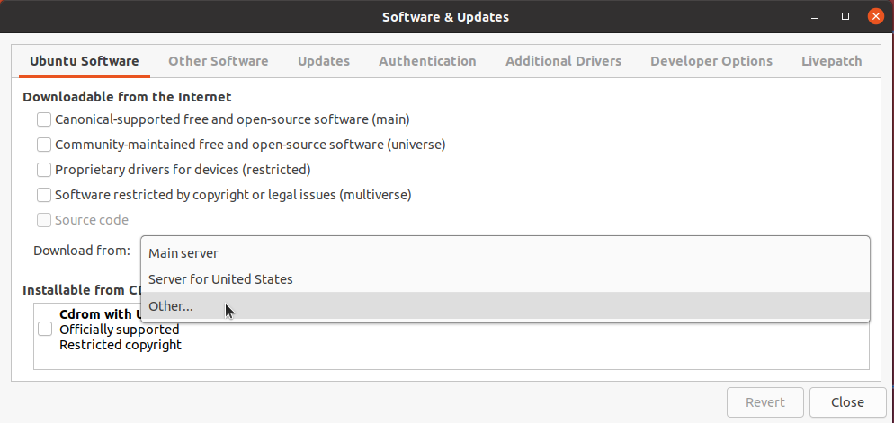
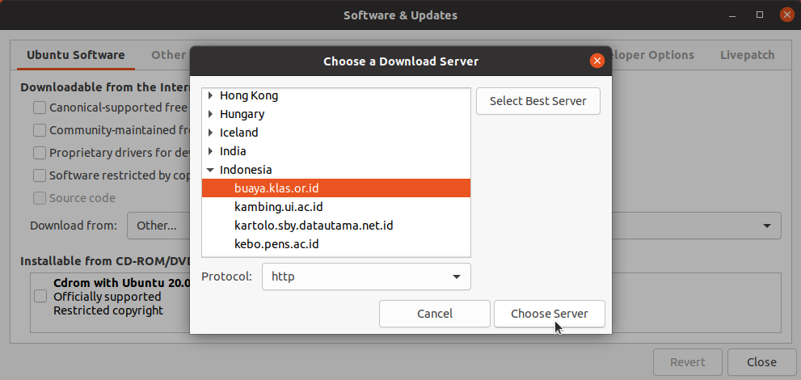

## Apa itu Buaya KLAS?
Buaya KLAS merupakan mirror Linux gratis yang dirawat oleh teman-teman KLAS (Kelompok Linux Arek Suroboyo) dimana server ini berada di daerah Kota Surabaya, Indonesia. Saat ini ada 6 distribusi Linux yang ada di Buaya, yaitu: 
- [Ubuntu](https://buaya.klas.or.id/ubuntu)
- [Ubuntu Ports](http://buaya.klas.or.id/ubuntu-ports)
- [openSUSE Leap](http://buaya.klas.or.id/opensuse)
- [Arch Linux](http://buaya.klas.or.id/arch)
- [AlmaLinux](http://buaya.klas.or.id/almalinux)
- [Debian](http://buaya.klas.or.id/debian)
- [LibreOffice](http://buaya.klas.or.id/tdf/libreoffice)

Bagi kalian yang berada di Indonesia khususnya daerah Jawa Timur, kalian bisa menggunakan mirror Buaya atau menggunakan mirror lain yang berada di Indonesia agar waktu untuk mengunduh paket atau sekadar mengecek update bisa lebih efisien dan relatif lebih cepat.

## Bagaimana cara menggunakan mirror Buaya KLAS di Ubuntu?
Kita langsung ke pembahasan, disini saya akan memberikan tutorial melalui _Graphical User Interface_ atau GUI dan melalui terminal.

### Melalui GUI
1. Buka aplikasi "_Software & Updates_"
2. Pada bagian "_Download from:_", pilih _Other..._

3. Kemudian cari Indonesia dan lebarkan, kemudian pilih buaya.klas.or.id

4. Dan kemudian klik tombol "Choose server"
5. Setelah itu bisa tutup aplikasi dan jangan lupa untuk memperbarui paket

### Melalui Terminal
1. Sunting `/etc/apt/sources.list` dengan editor teks
2. Ganti semua URL bawaan ke URL Buaya KLAS `https://buaya.klas.or.id/ubuntu/`

    Example : 
    ```
    deb https://buaya.klas.or.id/ubuntu/ focal main 
    deb-src https://buaya.klas.or.id/ubuntu/ focal main 
    ```
3. Simpan perubahan
4. Jangan lupa untuk update paket dengan perintah `sudo apt update`